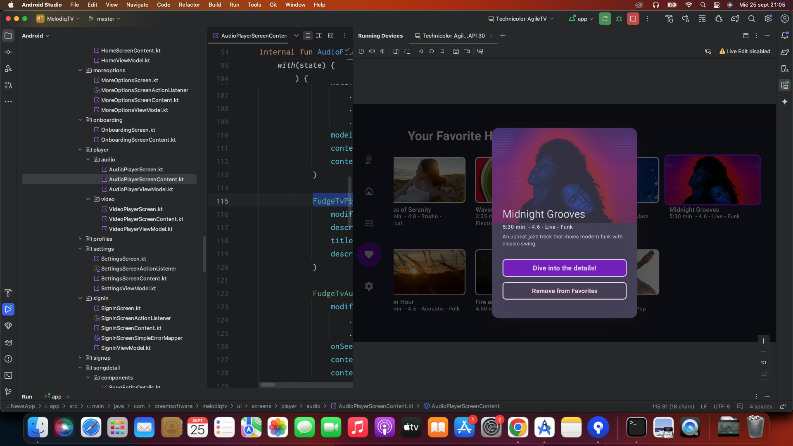
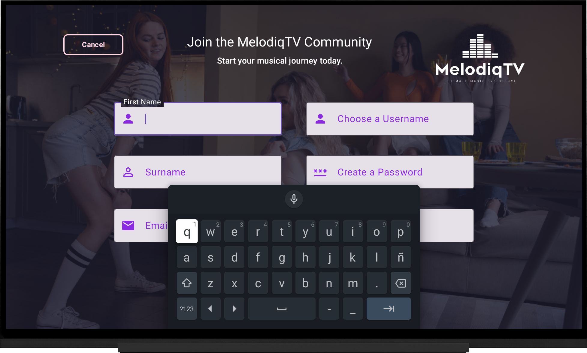
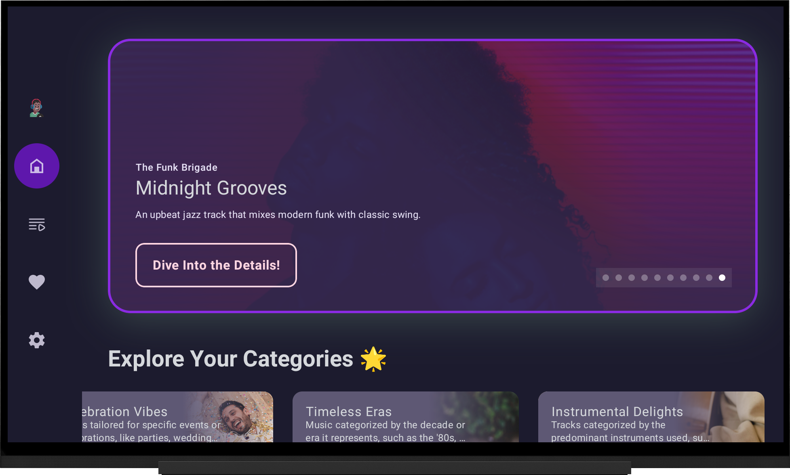
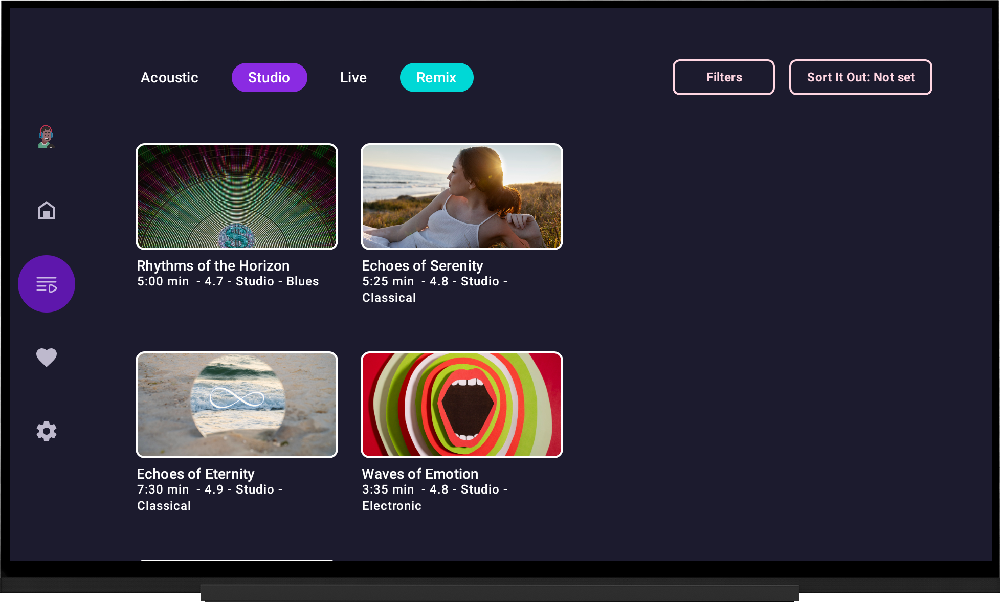

# MelodiqTV 🎶✨: Unleash the Power of Music on Your TV


**MelodiqTV** is a personal project I created to explore and learn about Android TV development, focusing on music streaming and UI/UX design. This app serves as a prototype for a music and video streaming platform, built entirely with resources for testing and experimentation. My goal with **MelodiqTV** is to dive deeper into Android TV development and get hands-on experience with the platform.

I used **Firebase 🔥** for real-time data synchronization and secure authentication to enhance the app's functionality. The project follows **Clean Architecture** and the **MVI pattern 🏛️**, which allows me to maintain a scalable and maintainable codebase as I continue to improve my development skills.

The user interface is crafted with **Jetpack Compose for TV 📺**, ensuring a modern and flexible design. I also integrated **[🍮 Fudge](https://github.com/sergio11/fudge_tv_compose_library)**, a UI kit for TV apps, to improve navigation and create a more polished experience on large screens.

A huge thank you to the creators of **[JetFit](https://github.com/TheChance101/tv-samples/tree/JetFit/JetFit)** and the contributors to **[PR #183](https://github.com/android/tv-samples/pull/183)** for providing an invaluable foundation for **MelodiqTV**. This is an attempt to provide an open-source implementation of JetFit. Licensed under **Apache 2.0** (implementation) and **CC BY 4.0** (design), JetFit served as a key reference for building a seamless **Jetpack Compose for TV** experience. I encourage you to visit the PR, review the effort, and give the deserved recognition. For more details and attributions, please check the **"Credits"** section below. 🚀

This app, **MelodiqTV**, includes images and resources designed by [Freepik](https://www.freepik.com). We would like to acknowledge and thank Freepik for their incredible design assets. The images used in the app are provided with attribution, as required by Freepik's licensing terms. For more information on Freepik's resources, please visit [www.freepik.com](https://www.freepik.com).

For the purpose of this project, I have used a free demonstration video sourced from **Mixkit**. The video showcases a young girl dancing and serves as an example to demonstrate the app's features in action.
You can view the video used here: [Young Black-Haired Girl Dancing - Mixkit](https://mixkit.co/free-stock-video/young-black-haired-girl-dancing-40367/).
This video is only for demonstration purposes and is not part of the final project’s original content.

<p align="center">
  
  
  
  
  
</p>

<p align="center">
  
  
  
  
  
</p>

Slides are built using the  template from [Previewed](https://previewed.app/template/AFC0B4CB). I extend my gratitude to them for their remarkable work and contribution.

## ⚠️ Disclaimer

This project, **MelodiqTV**, has been developed **for educational purposes only**. The main objective is to explore and learn how to build **modern Android TV applications** using **Jetpack Compose** and related technologies.

**MelodiqTV does not provide any music streaming content, licenses, or music programs.** Instead, it serves as a **demonstration project** showcasing how to design and develop TV-based music and video applications. The UI, navigation, and functionalities are implemented to simulate a real-world music streaming app experience.

Additionally, the name **"MelodiqTV"** was generated during a **brainstorming session with AI**, and any resemblance to existing brands or services is purely **coincidental**.

The **logo of MelodiqTV** was **generated by ChatGPT** and is **free of copyright restrictions**. It is provided exclusively for **demonstration and educational purposes** and does not represent an actual brand or commercial entity.  

This repository is intended solely for **learning, experimentation, and non-commercial purposes**. If you wish to develop a real music streaming service, please ensure compliance with content licensing, intellectual property, and relevant regulations.

## 🌟 Explore These Incredible Android TV Projects! 📺🚀  

Delve into the world of **Android TV development** with these cutting-edge projects. Each one demonstrates the power of **Jetpack Compose**, **Clean Architecture**, and innovative design principles, offering unique, practical solutions.  

## Featured Projects 🌟  

#### [**TvNexa - Your Global IPTV Destination** 🌐📺 ](https://github.com/sergio11/tvnexa_androidtv)
Experience global entertainment with **TvNexa**, a platform offering:  
- **Access to diverse international channels**  
- **Seamless multi-device compatibility**  
- A modern, intuitive interface  

#### [**FitFlexTV - Your Fitness Companion** 🏋️‍♂️💪](https://github.com/sergio11/fitflextv_android)
Stay active and fit with **FitFlexTV**, featuring:  
- **A variety of workouts** including yoga and HIIT  
- **Personalized fitness plans**  
- **Smooth navigation** optimized for Smart TVs  

#### [**SaboryTV - Your Culinary Guide** 🍳📺 ](https://github.com/sergio11/saborytv_android)
Refine your cooking skills with **SaboryTV**, providing:  
- **Step-by-step video recipes** tailored to your taste  
- **Hands-free navigation** for seamless cooking  
- **Expert guidance** from professional chefs  
  
#### [**NimbusTV - Effortless M3U Streaming** 🌐📺](https://github.com/sergio11/nimbustv_android)
Simplify streaming with **NimbusTV**, your go-to M3U playlist solution:  
- **Support for multiple playlists**: Organize by theme (sports, news, etc.)  
- **EPG integration**: Real-time programming schedules with reminders  
- **Advanced streaming formats**: HLS, DASH, and more  

## Why Check Out These Projects? 💡  
- **Learn Modern TV Development**: Explore practical implementations of Jetpack Compose and advanced architecture.  
- **Hone Your Skills**: Tackle real-world challenges like streaming, multi-user setups, and immersive UIs.  
- **Get Inspired**: Use these projects as templates for your own creations.  


## Overview 🌐

**MelodiqTV** is a personal project I’ve developed as part of my exploration into Android TV app development. It’s not a fully-fledged music streaming service, but rather an experiment to learn how to create a music and video platform for the TV environment.

Here’s a look at what I’ve been working on so far:

<p align="center">
  
</p>

### Personalized Profiles 👥
One of the features I’ve integrated is personalized profiles, where users (or family members) can create their own profiles. This allows for saving favorites and experimenting with music recommendations, giving each profile a unique experience. It’s been a fun way to dive into user data management and customization.

<p align="center">
  
</p>

### Advanced Music Search 🔍
As part of my learning process, I’ve implemented an advanced search feature that allows users to filter songs by different criteria:
- **Genre** 🎵: Explore different music genres.
- **Mood** 😊: Find music that matches your current mood.
- **Language** 🌍: Select tracks in your preferred language.
- **Release Date** 📅: Discover the latest releases or timeless classics.

<p align="center">
  
</p>

### Customizable Preferences ⚙️
For further customization, MelodiqTV allows for personalized settings, including:
- **Default Video Quality** 📺: Set your preferred resolution for music videos.
- **App Language** 🌐: Choose the app’s language.
- **Playback Options** 🎧: Adjust playback settings for a tailored experience.

These settings are part of my ongoing learning process in user experience design and how to create a more personalized and enjoyable app experience.

<p align="center">
  
</p>

## Technologies Used 🛠️

- **Kotlin**: The preferred language for developing Android applications, offering modern syntax and powerful features to enhance productivity. 🚀

- **Firebase Platform**:
  - **Firestore**: 🔥 A NoSQL cloud database providing real-time data synchronization and offline support, ensuring fast and reliable data retrieval. 📊✨
  - **Firebase Auth**: 🔐 Simplifies user authentication with secure sign-in and user management capabilities. Supports various authentication methods. 🛡️📱
  - **Firebase Storage**: ☁️ Stores user-generated content like profile images and media files with built-in security and seamless integration. 📸🎥

- **Coroutines**: 🌀 Simplifies asynchronous programming and manages background tasks efficiently, enhancing app responsiveness. ⏱️

- **Clean Architecture**: 🏗️ Promotes a well-structured and scalable app design by separating concerns into distinct layers, enhancing maintainability and testability. 🔍

- **MVI (Model-View-Intent)**: 📈 Implements a unidirectional data flow pattern, ensuring a clear separation between UI components and business logic. 🔄

- **Jetpack Compose for TV**: 📺 Utilizes Jetpack Compose to build modern, responsive UIs tailored for TV screens, optimizing the interface for large displays. 🎨

- **Jetpack Compose Navigation**: 🗺️ Facilitates in-app navigation and screen transitions with a clear API, supporting deep linking and complex navigation flows effortlessly. 🚦

- **Material Design 3**: 🎨 Applies the latest Material Design guidelines to create a visually appealing and intuitive user interface. 🖌️

- **🍮 Fudge**: [Fudge](https://github.com/sergio11/fudge_tv_compose_library) is a Jetpack Compose UI Kit for TV apps, providing pre-built components and tools to craft engaging experiences on the big screen. 🎬🚀

- **Jetpack DataStore**: 💾 A modern data storage solution for key-value pairs and typed objects, ensuring reliable data handling in your app. 🔐

- **Media3 for Media Playback**:
  - **Media3 ExoPlayer**: 🎥 Part of the Media3 library, ExoPlayer supports various media formats and advanced features for high-quality playback. 📻🍿
  - **Media3 UI**: 🎨 Provides UI components for integrating media playback controls into your app’s interface. 🕹️

- **Dagger Hilt**: 🧩 A dependency injection library simplifying the management of dependencies and enhancing modularity in your app. 🔧💡

- **Mapper Pattern**: 🔄 Facilitates conversion between different data models, ensuring data consistency across application components. 📐

## Architecture Overview 🏛️

Our application is designed with a robust architecture for maintainability, testability, and flexibility. The architecture leverages several design patterns and principles:

### **Clean Architecture** 🏗️
Clean Architecture focuses on separating concerns into distinct layers:
- **Presentation Layer**: Handles UI and user interactions using Jetpack Compose for modern interfaces.
- **Domain Layer**: Contains business logic and use cases, independent of external frameworks.
- **Data Layer**: Manages data sources and repositories, abstracting data retrieval and storage.

### **Data Sources** 📦
Data sources fetch and manage data from various origins, including:
- **Remote Data Sources**: Interact with cloud services or web APIs (e.g., Firebase Firestore).
- **Local Data Sources**: Handle local data storage (e.g., Jetpack DataStore).

### **Repository Pattern** 🗃️
The repository pattern provides a unified interface for data access, decoupling data retrieval from the rest of the application for easier testing and maintenance.

### **Use Cases** 🧩
In the Domain Layer, Use Cases represent specific actions, encapsulating business logic and interacting with repositories to retrieve or modify data.

### **Inversion of Control (IoC)** 🔄
IoC inverts control flow, allowing dependencies to be injected rather than hardcoded, promoting modularity and reducing boilerplate code.

### **SOLID Principles** 📏
We apply SOLID principles to ensure our codebase remains clean and maintainable:
- **Single Responsibility Principle (SRP)**: Each class has one responsibility.
- **Open/Closed Principle (OCP)**: Classes are open for extension but closed for modification.
- **Liskov Substitution Principle (LSP)**: Subtypes must be substitutable for their base types.
- **Interface Segregation Principle (ISP)**: Clients should not depend on interfaces they do not use.
- **Dependency Inversion Principle (DIP)**: High-level modules depend on abstractions.

### **MVI (Model-View-Intent)** 📈
MVI manages state and interactions, ensuring a predictable unidirectional data flow.

This architecture ensures that MelodiqTV is well-structured, easy to maintain, and scalable, adhering to best practices and design principles.

## App Screenshots 📸

Welcome to **Melodiq**! These screenshots are part of a personal project where I explored the concept of an app designed to enhance the music experience. The goal was to create an engaging and intuitive user interface for those who love music. Here’s a sneak peek into how it would look!

### Onboarding 🏠

The onboarding screens are the first thing a user sees when they open **Melodiq** for the first time. If you haven’t logged in yet, you’ll be greeted by a welcoming landing page, giving you a glimpse of what’s inside 📜. From here, you can either log in 🔒 or create a new account 🆕 to kickstart your musical adventure.

<p align="center">
  
</p>

<p align="center">
  
</p>

<p align="center">
  
</p>

### Sign In 🔑

If you're ready to dive into **Melodiq**, the sign-in page is where the magic happens. Just enter your email and password to access your music world. If you don't have an account yet, signing up is just a tap away! 🌟✉️

<p align="center">
  
</p>

<p align="center">
  
</p>

### Sign Up ✨

Creating an account in **Melodiq** is quick and simple! 🎉 Once you enter your name 📝, email 📧, and a secure password 🔒, you’re all set to begin exploring and enjoying the app’s exclusive features 🚀🌟. Just hit "Register" ✅, and you’ll be part of the **Melodiq** experience!

<p align="center">
  
</p>

<p align="center">
  
</p>

### Managing Your Profiles 👤

In the **Profiles** section, users can easily manage their profiles to personalize their experience. You can choose a profile, edit it, or even delete it if you no longer need it.

<p align="center">
  
</p>

- **Profile Selection**: Select which profile you want to use. It’s your personal space to keep track of your favorite songs and get recommendations tailored just for you.

<p align="center">
  
</p>

- **Creating Profiles**: You can create up to four profiles, perfect for family members or different users. Each profile can have its own alias and avatar, making the experience fun and personalized!

<p align="center">
  
</p>

<p align="center">
  
</p>

- **Editing Profiles**: Changing your profile’s alias, avatar, or security PIN is quick and easy, allowing you to update your preferences whenever you like.

<p align="center">
  
</p>

<p align="center">
  
</p>

- **Deleting Profiles**: If you no longer need a profile, you can delete it and remove all the associated data, keeping your app clean and focused on the features you love most.

<p align="center">
  
</p>

The **Profiles** section is all about customization and flexibility, ensuring the app fits your needs and preferences.

<p align="center">
  
</p>

<p align="center">
  
</p>

### Exploring the Home Screen 📱

The **Home Screen** is designed to be the main entry point for exploring the music collection. It offers an organized and intuitive way to interact with the content. Here's an overview:

<p align="center">
  
</p>

<p align="center">
  
</p>

- **Featured Songs Carousel** 🎠: This section displays a rotating selection of songs. It’s intended to highlight popular or trending tracks, making it easy to explore new music.

<p align="center">
  
</p>

- **Categories Row** 📊: A horizontal list of music categories (e.g., genres, playlists) that allows users to browse different music styles based on their current interests or preferences.

<p align="center">
  
</p>

- **Personalized Music Recommendations** ⭐: Based on the user’s listening history and preferences, this section suggests songs that match their taste. It’s meant to offer relevant suggestions and enhance the user’s experience by showing tracks they might enjoy.

<p align="center">
  
</p>

The **Home Screen** is built to organize music exploration in a simple and straightforward way. Whether the user is interested in featured tracks, different categories, or personalized suggestions, the layout is designed to facilitate easy navigation and discovery.

<p align="center">
  
</p>

## Exploring Songs and More 🎶✨

The **Songs** section is where users can find a wide variety of music to explore. This part of the app is meant to allow for detailed navigation through different song categories and types, making it easy to discover new music or search for specific genres.

<p align="center">
  
</p>

Within this section, there are different ways to categorize and filter the songs:

<p align="center">
  
</p>

- **Song Types** 🌱🎵: Users can explore songs based on their style or genre:
  - **Pop** 🌟: Songs with mainstream appeal, featuring catchy melodies and rhythms.
  - **Rock** 🎸: High-energy songs that often feature guitars and strong rhythms.
  - **Classical** 🎻: Orchestral compositions with a focus on instrumentation and structure.
  - **Jazz** 🎷: Complex rhythms and improvisation-based songs.

<p align="center">
  
</p>

<p align="center">
  
</p>

<p align="center">
  
</p>

- **Categories** 📚: This allows users to search through different types of music collections:
  - **Hits** 🎤: The most popular songs at the moment.
  - **New Arrivals** 📅: Newly added music to the collection.
  - **Playlists** 📋: Curated collections of songs for different themes or moods.

<p align="center">
  
</p>

<p align="center">
  
</p>

- **Special Features** ✨: Sorting and filtering options 🔍 allow users to refine their music search based on genre, song type, or specific playlists.

<p align="center">
  
</p>

Once users find a song they’re interested in, they can view more details such as the artist, album, and release year. This gives them a better understanding of the song and its context.

## Song Details 🎶✨

The **Song Detail Screen** in this project aims to provide users with all the relevant information about a song to enhance their music experience. The goal is to create an interactive and informative space for users to learn more about their favorite tracks.

<p align="center">
  
</p>

### Features of the Song Details Screen:

<p align="center">
  
</p>

<p align="center">
  
</p>

- **Song Overview** 📝: This section provides essential information about the song, including its **description**, **artist information**, **release date**, and **duration**. It gives the user a quick overview of what to expect from the track.
  
- **Mood and Genre** 🎵: The song's mood and genre tags are displayed here, which helps users match their listening preferences and find similar tracks.

- **Lyrics** 📜: This feature presents the full lyrics of the song, allowing users to follow along or reflect on the words as they listen.

- **Related Songs** 🎧: Users can discover other songs by the same artist or within the same genre. These related tracks are curated to complement the song being currently viewed.

- **Music Video** 🎥: The **music video** for the song is integrated into the screen, allowing users to watch the video alongside listening to the track.

<p align="center">
  
</p>

<p align="center">
  
</p>

### Interactive Features 🎛️

The Song Detail Screen also includes several interactive features that enhance the overall experience:

<p align="center">
  
</p>

- **Add to Favorites** ❤️: Users can add their favorite songs to a personal playlist, which can be accessed later at any time.

- **Detailed Artist Info** 👨‍🎤: This option provides users with more information about the artist, including their discography, and allows them to explore additional tracks and albums.

- **Share the Song** 📲: If users want to share a song with others, they can easily do so via social media or messaging apps.

<p align="center">
  
</p>

- **Rate the Song** ⭐: Users can rate the song, giving feedback on their experience and seeing what others think.

- **More Options** 🎛️: Additional features allow users to tweak their preferences or access further artist insights for a deeper music exploration.

<p align="center">
  
</p>

<p align="center">
  
</p>
  
<p align="center">
  
</p>

These interactive options ensure that the **Song Detail Screen** is not only informative but also engaging. Whether users are reading the lyrics, exploring artist information, or sharing their favorite tracks, the screen is designed to provide a richer music experience with just a few taps.

<p align="center">
  
</p>

## Favorites Section 🌟

The **Favorites Section** is a key feature that allows users to create their own personalized music collection within the project. This feature enables easy access to all the songs users love the most.

<p align="center">
  
</p>

### Key Features in the Favorites Section:

- **Quick Access**: This feature provides a quick overview of all the songs users have marked as favorites, so they can revisit their top tracks without needing to search for them again. The goal is to make it easy to access and enjoy the songs that users listen to the most. ❤️
  
- **Detailed View**: By tapping on any favorite song, users can access a detailed view that includes lyrics, artist information, and more. This feature allows for a deeper exploration of the song without losing the context of why it's a favorite. 📋

- **Easy Listening**: With a single tap, users can play their favorite songs directly from the **Favorites Section**. The aim here is to provide a seamless, personalized listening experience. 🎧

The Favorites Section enhances the music exploration experience by offering quick and efficient access to cherished tracks. Users can easily enjoy their favorite songs and continue their musical journey without any hassle.

<p align="center">
  
</p>

---

## Music Player 🎥🎶

The **Music Player** is an integral part of the project, allowing users to listen to their favorite tracks in high quality while providing essential features to enhance the listening experience. The goal is to create a user-friendly and engaging interface for playing songs.

<p align="center">
  
</p>

<p align="center">
  
</p>

### Features of the Music Player:

- **High-Quality Audio** 🎧: The player is designed to deliver clear and crisp audio, supporting various audio formats. It automatically adjusts based on the user's connection and preferences to provide the best experience possible.

<p align="center">
  
</p>

- **Player Controls** ⏯️: The music player comes with simple and intuitive controls. Users can play, pause, skip, or rewind tracks with ease. This ensures that users can control their listening experience without frustration.

- **On-Screen Lyrics** 📝: As the song plays, lyrics are displayed on the screen, synced with the music. This allows users to sing along or dive deeper into the meaning behind the song. It also adds an interactive element to the listening experience.

- **Progress Tracking** ⏳: The music player includes a progress bar that shows how much of the song has been played and how much is left. This feature allows users to keep track of their current listening session.

- **Full-Screen Mode** 📱: The player can be switched to full-screen mode, providing an immersive experience by removing any distractions and allowing users to focus on the music and lyrics.

<p align="center">
  
</p>

<p align="center">
  
</p>

The **Music Player** is designed to make the listening experience both enjoyable and interactive. Whether users are listening to their favorite playlist or exploring new tracks, the player provides the tools necessary to fully engage with the music.

<p align="center">
  
</p>

### Subscription Options 🌟🎶

The **Subscriptions Section** gives users access to additional features and content by offering flexible subscription plans. This section is aimed at enhancing the overall music experience within the project.

<p align="center">
  
</p>

### Subscription Features:

- **Choose Your Plan** 🗓️: Users can select from three subscription options: 1 month, 6 months, or 12 months. Each plan provides unlimited access to a wide range of premium content, including exclusive tracks and albums.

- **Enjoy Discounts** 💰: Longer subscription plans come with discounts, making it more affordable for users to access premium content. This is designed to encourage users to commit for longer periods, with added savings.

- **Unlock Premium Tracks** 🔓: Subscribing to a plan unlocks access to premium tracks and albums that are unavailable in the free version. This includes curated playlists, exclusive artist interviews, and other content designed to enrich the user’s music journey.

<p align="center">
  
</p>

The **Subscriptions Section** adds value to the project by offering users the ability to access premium features. Whether for casual listeners or dedicated music fans, this section helps provide an enhanced and flexible experience.

🎶🚀


---

### Settings 🛠️🎧

The **Settings** section in this project acts as a control center where users can customize and adjust their music experience based on their preferences. The aim here is to give full control over various aspects of the application to make it more personalized.

<p align="center">
  
</p>

### Key Features in the Settings Section:

- **Adjust Language** 🌐: Users can select the language they feel most comfortable with. Whether it’s English, Spanish, or any other language, the platform adapts to the user’s choice for a more seamless and personalized experience.

<p align="center">
  
</p>

<p align="center">
  
</p>

- **Select Audio Quality** 🎧: This feature allows users to control the audio quality of their music streaming. Depending on the user’s internet connection and device, they can choose from different levels of audio quality, including standard, high-quality, or lossless formats.

<p align="center">
  
</p>

- **Manage Subscriptions** 💳: This option enables users to review and modify their subscription plans. Whether it’s upgrading to a higher plan, downgrading, or even canceling the subscription, users can easily manage their account and payment preferences.

<p align="center">
  
</p>

- **Learn About Us** 🎤: This section provides users with more information about the team behind the platform. Users can learn about the mission, vision, and the artists or curators who power the music experience.

- **Log Out** 🚪: A simple option for logging out or switching accounts. This ensures that users can securely manage their profiles and make adjustments to their settings without hassle.

<p align="center">
  
</p>

The **Settings** section is all about giving users control over their experience. Whether it's changing the language, adjusting audio quality, or managing subscriptions, it ensures that each user can have a customized and smooth listening journey. 🎶🛠️

## ⚠️ Disclaimer

This project, **MelodiqTV**, has been developed **for educational purposes only**. The main objective is to explore and learn how to build **modern Android TV applications** using **Jetpack Compose** and related technologies.

**MelodiqTV does not provide any music streaming content, licenses, or music programs.** Instead, it serves as a **demonstration project** showcasing how to design and develop TV-based music and video applications. The UI, navigation, and functionalities are implemented to simulate a real-world music streaming app experience.

Additionally, the name **"MelodiqTV"** was generated during a **brainstorming session with AI**, and any resemblance to existing brands or services is purely **coincidental**.

The **logo of MelodiqTV** was **generated by ChatGPT** and is **free of copyright restrictions**. It is provided exclusively for **demonstration and educational purposes** and does not represent an actual brand or commercial entity.  

This repository is intended solely for **learning, experimentation, and non-commercial purposes**. If you wish to develop a real music streaming service, please ensure compliance with content licensing, intellectual property, and relevant regulations.

## Contribution
Contributions to MelodiqTV Android are highly encouraged! If you're interested in adding new features, resolving bugs, or enhancing the project's functionality, please feel free to submit pull requests.

## 🎖️ Recognition & Credits  

MelodiqTV is developed and maintained by Sergio Sánchez Sánchez (Dream Software). Special thanks to the open-source community and the contributors who have made this project possible. If you have any questions, feedback, or suggestions, feel free to reach out at dreamsoftware92@gmail.com.

A huge thank you to the creators of **[JetFit](https://github.com/TheChance101/tv-samples/tree/JetFit/JetFit)** and the contributors to **[PR #183](https://github.com/android/tv-samples/pull/183)** for providing an invaluable foundation for **MelodiqTV**. This is an attempt to provide an open-source implementation of JetFit. Licensed under **Apache 2.0** (implementation) and **CC BY 4.0** (design), JetFit served as a key reference for building a seamless **Jetpack Compose for TV** experience. I encourage you to visit the PR, review the effort, and give the deserved recognition. 

The **JetFit** project, licensed under **Apache 2.0**, has served as a foundational reference for implementing the **Jetpack Compose for TV UI framework**, while its design, licensed under **CC BY 4.0**, provided an excellent structure to build upon.  

### 📌 Resources:  
- **JetFit GitHub Repository**: [JetFit on GitHub](https://github.com/TheChance101/tv-samples/tree/JetFit/JetFit)  
- **JetFit Figma Design**: [JetFit Fitness App on Figma](https://www.figma.com/community/file/1237433831695839696/jetfit-fitness-app)  
- **JetFit Case Study & Guidelines**: [Google TV JetFit Case Study](https://developer.android.com/design/ui/tv/samples/jet-fit?hl=es-419)  
- **Google TV Design Kit**: [TV Design Kit (Figma)](https://developer.android.com/design/ui/tv/guidelines)  

The resources, examples, and insights provided in the **JetFit repository** significantly accelerated our development process and enriched our understanding of **building seamless TV applications using Jetpack Compose**. We deeply appreciate the contributions of the JetFit team and their dedication to open-source development.  

This project acknowledges and respects the **original JetFit implementation**, ensuring proper attribution under **Apache 2.0** and **CC BY 4.0** licenses. 🚀  

This project acknowledges and respects the work of the original **JetFit** creators and follows the **CC BY 4.0** license terms. If you are interested in designing a TV-based fitness app, we highly recommend exploring the **JetFit project and Google's TV design resources**.  

We express our deep appreciation to [Freepik](https://www.freepik.es/) for generously providing the resources used in this project.
<div> Icons and images takes from <a href="https://www.freepik.com" title="Freepik"> Freepik </a> from <a href="https://www.flaticon.es/" title="Flaticon">www.flaticon.es'</a></div>

For the purpose of this project, I have used a free demonstration video sourced from **Mixkit**. The video showcases a young girl dancing and serves as an example to demonstrate the app's features in action.
You can view the video used here: [Young Black-Haired Girl Dancing - Mixkit](https://mixkit.co/free-stock-video/young-black-haired-girl-dancing-40367/).
This video is only for demonstration purposes and is not part of the final project’s original content.

## Visitors Count


 
 ## Please Share & Star the repository to keep me motivated.
  <a href = "https://github.com/sergio11/melodiqtv_android/stargazers">
     
  </a>

## License ⚖️

This project is licensed under the **Apache License 2.0**, a permissive open-source software license that allows developers to freely use, modify, and distribute the software. 🚀 This includes both personal and commercial use, with some conditions for distribution and modification. 📜

Key terms of the Apache License 2.0:

- You are allowed to use, copy, modify, merge, publish, distribute, sublicense, and/or sell copies of the software. 💻
- If you modify and distribute the software, you must include the original copyright notice, provide a copy of the Apache 2.0 license, and indicate any modifications made. 📝
- You are not allowed to use the name of the project or its contributors to promote derived works without permission. ✋
- The software is provided "as is," without any warranties, express or implied. 🚫🛡️

Please see the full license text below for more detailed terms.

```
Apache License Version 2.0, January 2004 http://www.apache.org/licenses/

Copyright (c) 2024 Dream software - Sergio Sánchez

Licensed under the Apache License, Version 2.0 (the "License"); you may not use this file except in compliance with the License. You may obtain a copy of the License at

http://www.apache.org/licenses/LICENSE-2.0

Unless required by applicable law or agreed to in writing, software distributed under the License is distributed on an "AS IS" BASIS, WITHOUT WARRANTIES OR CONDITIONS OF ANY KIND, either express or implied. See the License for the specific language governing permissions and limitations under the License.
```
